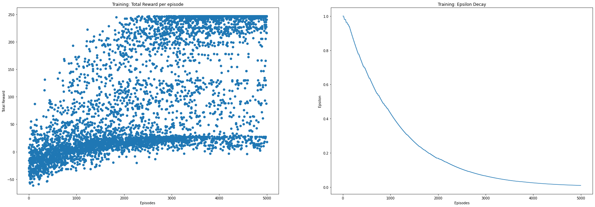
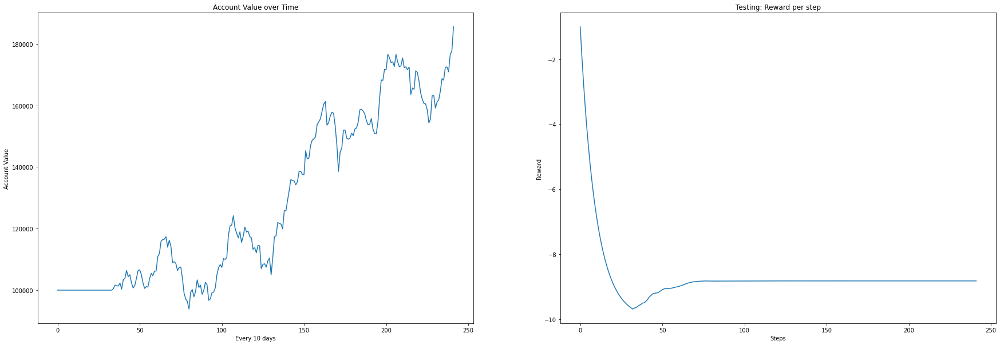

# Assignment 3 - QLearning

The goal of the assignment is to learn the trends in stock price and perform a series of trades over a period
of time and end with a profit. In each trade you can either buy/sell/hold. You will start with an investment
capital of $100,000 and your performance is measured as a percentage of the return on investment.
You will use the Q-Learning algorithm for reinforcement learning to train an agent to learn the trends
in stock price and perform a series of trades. You will implement Q-learning algorithm from scratch. The
purpose of this assignment is to understand the benefits of using reinforcement learning to solve the real
world problem of stock trading.

# Dataset

You have been given a dataset on the historical stock price for Nvidia for the last 5 years. The dataset has
1258 entries starting 10/27/2016 to 10/26/2021. The features include information such as the price at which
the stock opened, the intraday high and low, the price at which the stock closed, the adjusted closing price
and the volume of shares traded for the day.

# Observations

[Report](report.pdf)

